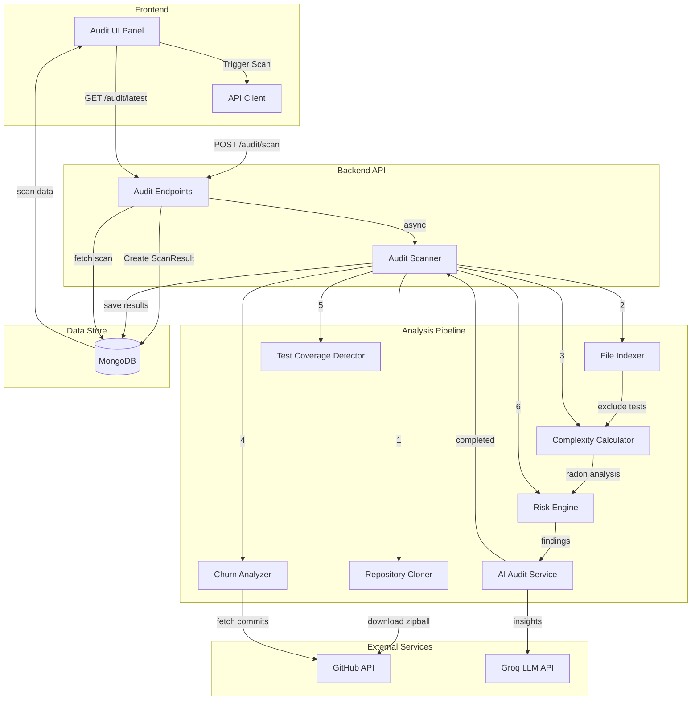

# RevFlo Repository Audit System - Technical Specification

## 1. Overview

The RevFlo Audit System is a comprehensive code health analysis engine that performs automated repository audits to identify architectural risks, code quality issues, and potential vulnerabilities. It combines deterministic rule-based analysis with AI-powered insights to provide actionable recommendations for improving codebase health.

### Key Features
- **Deterministic Code Analysis**: Rule-based detection of complexity, hotspots, and architectural issues
- **AI-Powered Insights**: LLM-generated executive summaries and remediation roadmaps
- **Real-Time Metrics**: Cyclomatic complexity, LOC analysis, and change frequency tracking
- **Test Coverage Detection**: Automatic identification of files lacking test coverage
- **Multi-Language Support**: Python (with Radon), JavaScript, TypeScript, Java, C++
- **Customizable Rules**: Config-driven thresholds and severity levels

---

## 2. System Architecture



---

## 3. Data Flow

### 3.1 Scan Initiation
```
User clicks "Run Audit" 
  → Frontend: POST /api/repos/{owner}/{repo}/audit/scan
  → Backend: Create ScanResult document (status: "pending")
  → Backend: Trigger async _process_scan()
  → Return: ScanResult with scan.id
```

### 3.2 Scan Processing Pipeline

#### Stage 1: Repository Acquisition
```python
await _clone_repo(repo_url, token, scan_dir)
# Downloads GitHub zipball to /tmp/revflo_scans/{scan_id}
```

#### Stage 2: File Indexing
```python
file_stats = await _index_files(scan_dir)
# Returns: [{"path": "...", "size": ..., "ext": "..."}]
# Excludes: .git, test directories, test files
```

#### Stage 3: Complexity Analysis
```python
complexity_map = await _calculate_complexity(scan_dir)
# Returns: {"path": {"complexity": int, "loc": int, "indent_depth": int}}
# Uses Radon for Python, proxy heuristics for others
```

#### Stage 4: Churn Calculation
```python
churn_map = await _calculate_churn(repo_url, token, file_stats)
# Returns: {"path": commit_count_last_90_days}
# Limited to top 20 files by size to avoid API rate limits
```

#### Stage 5: Test Coverage Detection
```python
test_coverage_map = await _detect_test_coverage(scan_dir, file_stats)
# Returns: {"source_path": has_corresponding_test}
```

#### Stage 6: Risk Analysis (Deterministic)
```python
top_risks = risk_engine.analyze(file_stats, churn_map)
# Applies 5 rules: Hotspot, Deep Nesting, Large File, Complex Module, No Tests
# Returns: List[RiskItem]
```

#### Stage 7: AI Enhancement
```python
report = await ai_service.generate_insights(top_risks, repo_context, snippets)
# LLM generates: executive summary, scores, roadmap, fragility map
# Returns: AuditReport
```

#### Stage 8: Scoring & Persistence
```python
scan.overall_score = calculate_score(top_risks)  # 100 - deductions
scan.categories = AI-generated scores (0-100)
scan.report = AuditReport from AI
await scan.save()  # status: "completed"
```

---

## 4. Core Components

### 4.1 Audit Scanner (`scanner.py`)

**Responsibilities:**
- Orchestrate the entire scan pipeline
- Manage temporary file storage
- Handle async processing
- Update scan status and results

**Key Methods:**
- `trigger_scan()`: Create pending scan, return immediately
- `_process_scan()`: Execute full pipeline asynchronously
- `_clone_repo()`: Download repository zipball
- `_index_files()`: Build file inventory (excludes tests)
- `_calculate_complexity()`: Compute complexity metrics
- `_calculate_churn()`: Fetch commit history from GitHub
- `_detect_test_coverage()`: Map source files to tests

**Configuration:**
```python
temp_dir = /tmp/revflo_scans  # Windows: %TEMP%/revflo_scans
engine_version = "2.0.0"
```

---

### 4.2 Risk Engine (`risk_engine.py`)

**Deterministic Rule Engine**

#### Rule 1: Hotspot Detection
```
IF complexity > 15 AND churn > 10 THEN
  severity: high
  finding: "High complexity + frequent changes = instability risk"
```

#### Rule 2: Deep Nesting
```
IF indent_depth > 5 THEN
  severity: medium
  finding: "Deep nesting reduces readability and testability"
```

#### Rule 3: Large File (Monolith)
```
IF loc > 300 THEN
  severity: medium
  finding: "File size suggests too many responsibilities"
```

#### Rule 4: Complex Module
```
IF complexity > 20 THEN
  severity: medium
  finding: "High cyclomatic complexity is hard to maintain"
```

#### Rule 5: No Tests
```
IF loc > 100 AND has_test = false AND NOT is_test_file THEN
  severity: medium
  finding: "Substantial file without test coverage"
```

**Configuration System:**
```yaml
# .revflo.yml (optional, in repo root)
rules:
  hotspot:
    enabled: true
    severity: high
    thresholds:
      complexity: 15
      churn: 10
      
  large_file:
    enabled: true
    severity: medium
    thresholds:
      loc: 300
```

**Exclusions:**
- Test directories: `/test/`, `/tests/`, `/__test__/`, `/spec/`  
- Test files: `test_*.py`, `*_test.js`, `*.spec.ts`

---

### 4.3 AI Audit Service (`ai_audit.py`)

**LLM-Powered Analysis Layer**

**Input:**
```python
{
  "top_risks": List[RiskItem],  # From risk_engine
  "repo_context": {
    "file_count": int,
    "total_churn_commits": int,
    "language_breakdown": {"ext": count}
  },
  "snippets": {
    "README": "...",
    "file1.py": "...",  # Top 2 complex files
  }
}
```

**LLM Prompt Structure:**
```
You are a Principal Software Architect explaining audit results.

CONTEXT:
- Risk Findings: [JSON of deterministic findings]
- Code Snippets: [README + top complex files]
- Repo Context: [file count, languages, churn]

INSTRUCTIONS:
1. Generate health scores (0-100) for 6 dimensions
2. Explain WHY the metrics are problematic
3. Create remediation roadmap (fix_now, fix_next, defer)

SCORING GUIDANCE:
- 90-100: Excellent
- 70-89: Good
- 50-69: Moderate issues
- 30-49: Poor
- 0-29: Critical

Deduct points based on findings:
- Critical: -15
- High: -10
- Medium: -5
- Low: -2

OUTPUT (JSON):
{
  "summary": {
    "maintainability": 75,
    "security": 85,
    "performance": 70,
    "testing_confidence": 60,
    "code_quality": 75,
    "architecture": 80,
    "overview": "..."
  },
  "fragility_map": {
    "high_risk_modules": ["file1", "file2"],
    "change_sensitive_areas": []
  },
  "roadmap": {
    "fix_now": ["Action 1"],
    "fix_next": ["Action 2"],
    "defer": ["Action 3"]
  },
  "executive_takeaway": "One sentence summary"
}
```

**Model Configuration:**
```python
model = "llama-3.1-8b-instant"  # Groq
temperature = 0.2  # Low for determinism
response_format = {"type": "json_object"}  # Structured output
```

**Token Optimization:**
- README: truncated to 1000 chars
- Code snippets: top 2 files only, max 3000 chars each
- Total context: ~6000 tokens (within Groq TPM limits)

---

### 4.4 Data Models

#### ScanResult Document
```python
class ScanResult(Document):
    # Metadata
    repo_id: PydanticObjectId
    status: "pending" | "processing" | "completed" | "failed"
    commit_sha: Optional[str]
    engine_version: str = "2.0.0"
    
    # Scoring
    risk_level: "low" | "medium" | "high" | "critical"
    overall_score: int = 0  # 0-100 from calculate_score()
    
    # Metrics
    categories: AuditCategories  # 6 scores from AI
    lines_of_code: int = 0
    raw_metrics: dict  # {"file_count", "total_lines", "complexity_avg"}
    
    # Findings
    findings: List[Finding]  # From risk_engine (legacy)
    report: AuditReport  # From AI service
    
    # Timing
    started_at: datetime
    completed_at: Optional[datetime]
    
    class Settings:
        name = "scans"
```

#### AuditReport (AI-Generated)
```python
class AuditReport(BaseModel):
    summary: AuditSummary  # 6 numeric scores + overview
    top_risks: List[RiskItem]  # Pass-through from risk_engine
    fragility_map: FragilityMap  # high_risk_modules, change_sensitive_areas
    roadmap: Roadmap  # fix_now, fix_next, defer
    security_reliability: List[SecurityReliabilityItem]
    executive_takeaway: str
```

#### AuditCategories (Scores)
```python
class AuditCategories(BaseModel):
    security: int = 0       # 0-100
    performance: int = 0
    code_quality: int = 0
    architecture: int = 0
    maintainability: int = 0
    dependencies: int = 0
```

---

## 5. Scoring Algorithm

### 5.1 Overall Score Calculation
```python
def calculate_score(findings: List[RiskItem]) -> int:
    """Deterministic scoring (V1 contract)"""
    score = 100
    for risk in findings:
        if risk.severity == "critical": score -= 15
        elif risk.severity == "high": score -= 10
        elif risk.severity == "medium": score -= 5
        elif risk.severity == "low": score -= 2
    return max(0, score)  # Floor at 0
```

### 5.2 Risk Level Assignment
```python
if overall_score >= 80: risk_level = "low"
elif overall_score >= 60: risk_level = "medium"
elif overall_score >= 40: risk_level = "high"
else: risk_level = "critical"
```

### 5.3 Category Scores (AI-Generated)
- AI analyzes findings distribution by type
- Generates 0-100 scores for each dimension
- Falls back to `overall_score` if AI fails

---

## 6. Frontend Integration

### 6.1 API Endpoints

#### Trigger Scan
```http
POST /api/repos/{owner}/{repo}/audit/scan
Response: ScanResult (status: "pending")
```

#### Get Latest Scan
```http
GET /api/repos/{owner}/{repo}/audit/latest
Response: ScanResult | null
```

#### Get Scan History
```http
GET /api/repos/{owner}/{repo}/audit/history?days=30
Response: List[ScanResult] (time-series)
```

### 6.2 Frontend Display Components

#### Stats Cards (Basic Metrics)
```tsx
<Card>Total Issues: {auditData.total_issues}</Card>
<Card>Security Issues: {auditData.security_issues}</Card>
<Card>Code Quality: {auditData.code_quality_issues}</Card>
<Card>Lines Analyzed: {auditData.lines_analyzed}</Card>
```

#### Health Scores Panel
```tsx
{auditData.scores.overall !== undefined && (
  <ProgressBar value={auditData.scores.overall} max={100} />
)}
// + 6 category progress bars
```

#### Executive Summary
```tsx
<Card>
  <p>{auditData.report.overview}</p>
  <Highlight>{auditData.report.executive_takeaway}</Highlight>
</Card>
```

#### Fragility Map
```tsx
{auditData.report.fragility_map.high_risk_modules.map(module => (
  <Badge variant="destructive">{module}</Badge>
))}
```

#### Remediation Roadmap
```tsx
<Section title="Fix Now (Critical)">
  {auditData.report.roadmap.fix_now.map(action => (
    <li className="text-destructive">{action}</li>
  ))}
</Section>
```

#### Issue List (Expandable)
```tsx
{auditData.issues.map(issue => (
  <IssueRow
    severity={issue.severity}
    title={issue.title}
    file={issue.file_path}
    line={issue.line_number}
    description={issue.description}
  />
))}
```

---

## 7. Performance Considerations

### 7.1 Scalability Limits

| Repository Size | Processing Time | Notes |
|----------------|-----------------|-------|
| Small (<1000 LOC) | 10-30s | Fast, minimal API calls |
| Medium (1K-10K LOC) | 30s-2min | Standard processing |
| Large (10K-50K LOC) | 2-5min | Churn limited to top 20 files |
| Very Large (>50K LOC) | 5-10min | May timeout on free tier |

### 7.2 Optimizations

**Churn Calculation:**
- Limited to top 20 files by size
- Avoids GitHub API rate limits (5000/hour)
- Graceful degradation if API fails

**LLM Token Management:**
- README: 1000 char limit
- Code snippets: top 2 files only
- Total context: <6000 tokens

**Async Processing:**
- Scan runs in background task
- Frontend polls every 5 seconds
- Max polling: 2 minutes

**File Exclusions:**
- Skip `.git` directory
- Skip `node_modules`, `vendor`, etc.
- Skip all test files and directories

### 7.3 Error Handling

```python
try:
    # Scan pipeline
except Exception as e:
    logger.error(f"Scan failed: {e}")
    scan.status = "failed"
    scan.error_message = str(e)
    await scan.save()
finally:
    # Cleanup temp directory
    shutil.rmtree(scan_dir)
```

---

## 8. Configuration & Customization

### 8.1 Repository-Level Config

Place `.revflo.yml` in repository root:

```yaml
audit:
  rules:
    hotspot:
      enabled: true
      severity: high
      thresholds:
        complexity: 15
        churn: 10
    
    large_file:
      enabled: true
      severity: medium
      thresholds:
        loc: 300
    
    deep_nesting:
      enabled: true
      severity: medium
      thresholds:
        indent_depth: 5
    
    complex_module:
      enabled: true
      severity: medium
      thresholds:
        complexity: 20
    
    no_tests:
      enabled: true
      severity: medium
      thresholds:
        min_loc: 100
```

### 8.2 Default Configuration

If `.revflo.yml` not found, uses built-in defaults from `config_parser.py`.

---

## 9. Future Enhancements

### 9.1 Planned Features
- Dependency vulnerability scanning (npm audit, pip-audit)
- Security pattern detection (SQL injection, XSS)
- Architecture diagram generation
- PR-level incremental audits
- Trend analysis over time
- Custom rule authoring (Python DSL)

### 9.2 Integration Opportunities
- GitHub Actions integration
- Slack/Discord notifications
- Jira issue creation from findings
- IDE plugins (VS Code, JetBrains)

---

## 10. Testing & Validation

### 10.1 Unit Tests
```bash
pytest backend/tests/audit/
# Tests for risk_engine, ai_audit, scanner components
```

### 10.2 Integration Tests
```bash
# Test full scan pipeline on sample repos
pytest backend/tests/integration/test_audit_pipeline.py
```

### 10.3 Regression Tests
- Ensure V1 scans still validate (backward compatibility)
- Test string → int score migration for old data

---

## 11. Monitoring & Observability

### 11.1 Metrics to Track
- Scan completion rate (success vs failed)
- Average scan duration by repo size
- AI service response time
- GitHub API rate limit usage
- Disk space usage in `/tmp`

### 11.2 Logging
```python
logger.info(f"Cloning {repo_url}")
logger.info(f"Loaded {len(file_stats)} files")
logger.info(f"Detected {len(top_risks)} risks")
logger.error(f"Scan failed: {error}")
```

---

## 12. Security Considerations

### 12.1 Data Privacy
- Temporary scan directories cleaned up after scan
- No source code stored in database (only metrics)
- GitHub tokens encrypted in database

### 12.2 Rate Limiting
- Scans limited per user/repo to prevent abuse
- GitHub API calls throttled to avoid rate limits

### 12.3 Input Validation
- Repository URL validated against GitHub pattern
- File paths sanitized to prevent directory traversal
- ZIP extraction secured against zip bombs

---

## Appendix: Key Files Reference

| Component | File Path | Lines | Purpose |
|-----------|-----------|-------|---------|
| Scanner | `backend/app/services/audit/scanner.py` | 475 | Main orchestrator |
| Risk Engine | `backend/app/services/audit/risk_engine.py` | 129 | Deterministic rules |
| AI Service | `backend/app/services/audit/ai_audit.py` | 130 | LLM integration |
| Models | `backend/app/models/scan.py` | 116 | Data schemas |
| API | `backend/app/api/v1/endpoints/audit.py` | 130 | REST endpoints |
| Frontend | `frontend/src/components/AuditPanel.tsx` | 850 | UI component |

---

**Document Version:** 1.0  
**Last Updated:** 2025-12-28  
**Author:** RevFlo Engineering Team
